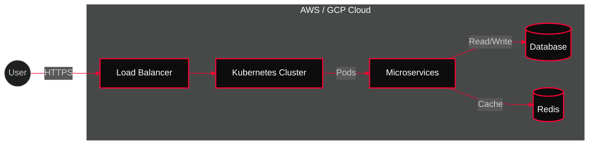

<div align="center">

```
 ██████╗██╗      ██████╗ ██╗   ██╗██████╗     ██████╗ ███████╗██╗   ██╗ ██████╗ ██████╗ ███████╗
██╔════╝██║     ██╔═══██╗██║   ██║██╔══██╗    ██╔══██╗██╔════╝██║   ██║██╔═══██╗██╔══██╗██╔════╝
██║     ██║     ██║   ██║██║   ██║██║  ██║    ██║  ██║█████╗  ██║   ██║██║   ██║██████╔╝███████╗
██║     ██║     ██║   ██║██║   ██║██║  ██║    ██║  ██║██╔══╝  ╚██╗ ██╔╝██║   ██║██╔═══╝ ╚════██║
╚██████╗███████╗╚██████╔╝╚██████╔╝██████╔╝    ██████╔╝███████╗ ╚████╔╝ ╚██████╔╝██║     ███████║
 ╚═════╝╚══════╝ ╚═════╝  ╚═════╝ ╚═════╝     ╚═════╝ ╚══════╝  ╚═══╝   ╚═════╝ ╚═╝     ╚══════╝

**CLOUD & DEVOPS ENGINEER**
```


<div align="center">
  <a href="mailto:kashvit@live.in">
    
  </a>
  <a href="https://opswork.cloud">
    
  </a>
  <a href="https://www.credly.com/users/hacrex/">
    
  </a>
</div>


</div>

---

<div align="center">
  
</div>

<div align="center">
  <a href="https://linkedin.com/in/kashvit9">
    
  </a>
  <a href="https://hackunderroot.blogspot.com">
    
  </a>
  <a href="https://github.com/hacrex">
    
  </a>
  <a href="https://twitter.com/hacrex">
    
  </a>
  <a href="https://instagram.com/hacrex">
    
  </a>
  <a href="https://tiktok.com/@hacrex">
    
  </a>
</div>

---

<div align="center">
  
</div>

<div align="center">
  
</div>


**Ashvit D. Khandare**

**Cloud Engineer | DevOps & Platform Engineer**  
Indore, India · +91-9823497600 · kashvit@live.in  
**LinkedIn**: https://linkedin.com/in/kashvit9 · **Portfolio**: https://opswork.cloud  

<!-- BLOG-POST-LIST:START -->
- [Virtualization vs Containerization: Understanding the Key Differences](https://hackunderroot.blogspot.com/2014/09/virtualization-vs-containerization.html)
- [Containerization: Revolutionizing the Way Applications are Deployed and Managed](https://hackunderroot.blogspot.com/2014/09/containerization-revolutionizing-way.html)
- [Virtualization 2.0: The Future of IT Infrastructure](https://hackunderroot.blogspot.com/2013/05/virtualization-20-future-of-it.html)
- [V12N in Detail....](https://hackunderroot.blogspot.com/2014/01/v12n-in-detail.html)
- [Virtualization](https://hackunderroot.blogspot.com/2014/01/virtualization.html)
<!-- BLOG-POST-LIST:END -->


<div align="center">
  
</div>

```diff
! [IDENTITY]: Ashvit D. Khandare
+ ROLE: Cloud & DevOps Architect
# LOCATION: Indore, India | CONTACT: kashvit@live.in

- MISSION: Designing, automating, and optimizing cloud infrastructure.
- SPECIALTY: Reducing cloud costs (40%), cutting downtime (60%), and zero-downtime migrations.
- STACK: AWS, GCP, Azure, Kubernetes, Terraform.
```

<div align="center">
  
</div>

```diff
! [SYSTEM_LOG]: Accessing Career Records...

+ [CURRENT]: Anaxee Digital Runners
# ROLE: Cloud Engineer
- IMPACT: 40% Cost Reduction via Spot Instances & Rightsizing
- IMPACT: 99.9% Uptime for critical services
- IMPACT: Zero-Downtime Migrations

+ [HISTORY]: Freelance Consultant
# ROLE: Cloud Consultant
- IMPACT: Delivered secure cloud solutions
- IMPACT: Migrated 50+ business email accounts
- IMPACT: Troubleshooting scale issues
```

<div align="center">
  
</div>


<div align="center">

<a href="https://www.credly.com/users/hacrex/"></a>
<a href="https://www.credly.com/users/hacrex/"></a>
<a href="https://www.credly.com/users/hacrex/"></a>
<a href="https://www.credly.com/users/hacrex/"></a>

</div>

<div align="center">
  
</div>

```diff
! [MODULES]: Loading Project Profiles...

+ [PROJECT]: Opswork.cloud
# TYPE: Multi-Cloud DevOps Portfolio
- STACK: AWS EKS | Terraform | GitLab CI

+ [PROJECT]: Toolsea AI
# TYPE: AI-Powered Cloud Management
- STACK: GCP Vertex AI | K8s | ArgoCD

+ [PROJECT]: DawnFit App
# TYPE: Cloud-Native Fitness Platform
- STACK: Azure AKS | Docker | Prometheus

+ [PROJECT]: Hackunderroot
# TYPE: Cybersecurity Blog
- STACK: Static Site | CloudFront | S3

+ [PROJECT]: Crypto Tracker
# TYPE: Real-time Dashboard
- STACK: Node.js | React | External APIs
```

---

---

<div align="center">
  
</div>

```diff
! [hacrex@cloud-ops]─[~/infrastructure]
- $ kubectl get nodes --all-namespaces
# NAME                STATUS   ROLES    AGE     VERSION
# master-node-1       Ready    master   365d    v1.28.0
# worker-node-1       Ready    <none>   365d    v1.28.0

! [hacrex@cloud-ops]─[~/infrastructure]  
- $ terraform plan | grep "Plan:"
+ Plan: 847 to add, 23 to change, 12 to destroy.

! [hacrex@cloud-ops]─[~/infrastructure]
- $ echo "MISSION: Architect. Deploy. Scale. Optimize."
- MISSION: Architect. Deploy. Scale. Optimize.
```

**CORE COMPETENCIES**

> *"Transforming complex cloud challenges into automated, scalable solutions."*

`Multi-Cloud Architecture` • `Infrastructure as Code` • `Container Orchestration`  
`CI/CD Engineering` • `Observability` • `Cost Optimization` • `Security Compliance`


---

<div align="center">
  
</div>

<div align="center">

```diff
! ═══════════════════════════════════════════════════════════════════════════════
+ [SYSTEM]: LOADING TECHNICAL CAPABILITIES...
! ═══════════════════════════════════════════════════════════════════════════════
```

</div>

<table align="center">
<tr>
<td align="center" width="50%">

**CLOUD PLATFORMS**


</td>
<td align="center" width="50%">

**CLOUD OS & VIRTUALIZATION**


</td>
</tr>

<tr>
<td align="center">

**DEVOPS & IaC**


</td>
<td align="center">

**CI/CD PIPELINES**


</td>
</tr>

<tr>
<td align="center">

**CONTAINERS & ORCHESTRATION**


</td>
<td align="center">

**DEVSECOPS & SECURITY**


</td>
</tr>

<tr>
<td align="center">

**OBSERVABILITY & MONITORING**


</td>
<td align="center">

**AI & MACHINE LEARNING**


</td>
</tr>

<td align="center">

**DATABASES**


</td>
<td align="center">

**PROGRAMMING LANGUAGES**


</td>
</tr>
</table>

<div align="center">

**CLOUD SERVICES EXPERTISE**

</div>

<details>
<summary><b>AWS Core Services</b></summary>
<br>
<div align="center">


</div>
</details>

<details>
<summary><b>GCP Core Services</b></summary>
<br>
<div align="center">


</div>
</details>

<details>
<summary><b>Azure Core Services</b></summary>
<br>
<div align="center">


</div>
</details>

<details>
<summary><b>Oracle Cloud Services</b></summary>
<br>
<div align="center">


</div>
</details>

<details>
<summary><b>Alibaba Cloud Services</b></summary>
<br>
<div align="center">


</div>
</details>

<details>
<summary><b>OpenStack Services</b></summary>
<br>
<div align="center">


</div>
</details>

<details>
<summary><b>CloudStack Services</b></summary>
<br>
<div align="center">


</div>
</details>

<details>
<summary><b>DigitalOcean Services</b></summary>
<br>
<div align="center">


</div>
</details>

<details>
<summary><b>Akamai Services</b></summary>
<br>
<div align="center">


</div>
</details>

<div align="center">

```diff
! ═══════════════════════════════════════════════════════════════════════════════
+ [IMPACT METRICS]: 40% Cost Reduction | 99.9% Uptime | 60% Faster Deployments
! ═══════════════════════════════════════════════════════════════════════════════
```

</div>

---


---

## CONTINUOUS LEARNING


```diff
! [PIPELINE]: SKILL DEVELOPMENT SYNC

+ [LOADING]: MLOps & AIOps
- PROGRESS: [//////////////////..] 90%

+ [LOADING]: Machine Learning
- PROGRESS: [///////////////.....] 75%

+ [LOADING]: AI-Driven DevOps
- PROGRESS: [/////////////////...] 85%

+ [LOADING]: Serverless Architecture
- PROGRESS: [/////////////.......] 65%

# [CURRENT_FOCUS]: Cloud-Native AI Integration
# [MILESTONE]: Kubernetes AI Operator Development

! [SYS_CHECK]: /proc/learning/current_focus
- > Implementing MLOps pipelines on Kubernetes
- > AI-powered infrastructure cost optimization
- > Serverless computing with AWS Lambda & GCP Functions
- > Advanced Terraform modules for multi-cloud deployments
```

---

## COLLABORATION & PARTNERSHIPS


**SEEKING PARTNERSHIPS IN:**

- **Multi-Cloud Architecture** | **CI/CD Optimization**
- **Kubernetes Engineering** | **MLOps Implementation**  
- **Infrastructure Automation** | **Observability Stack**
- **Cloud Security & Compliance** | **Cost Optimization**

**COLLABORATION STYLE:** Agile, Remote-First, Open Source  
**AVAILABILITY:** Open to consulting & full-time opportunities

---

## INNOVATION METHODOLOGY


**TECHNIQUE:** "Vibe Coding"

**🏗️ ARCHITECTURE DESIGN**
- Conceptual, logical & physical design for public cloud solutions (infrastructure & platforms)


**APPLICATION:** Rapid prototyping of cloud infrastructure and DevOps workflows using creative problem-solving approaches that accelerate development cycles beyond traditional methods.

**RESULT:** 3x faster infrastructure deployment cycles

---

<div align="center">
  
  
  <br/>
  
</div>

<div align="center">
  
  <br/>
  <!-- Snake Animation Placeholder -->
  <picture>
    <source media="(prefers-color-scheme: dark)" srcset="https://raw.githubusercontent.com/hacrex/hacrex/output/github-contribution-grid-snake-dark.svg">
    <source media="(prefers-color-scheme: light)" srcset="https://raw.githubusercontent.com/hacrex/hacrex/output/github-contribution-grid-snake.svg">
    
  </picture>
</div>
