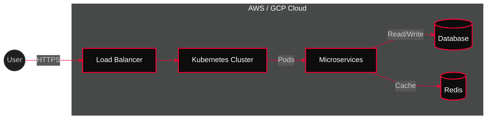

<div align="center">

```
 ██████╗██╗      ██████╗ ██╗   ██╗██████╗     ██████╗ ███████╗██╗   ██╗ ██████╗ ██████╗ ███████╗
██╔════╝██║     ██╔═══██╗██║   ██║██╔══██╗    ██╔══██╗██╔════╝██║   ██║██╔═══██╗██╔══██╗██╔════╝
██║     ██║     ██║   ██║██║   ██║██║  ██║    ██║  ██║█████╗  ██║   ██║██║   ██║██████╔╝███████╗
██║     ██║     ██║   ██║██║   ██║██║  ██║    ██║  ██║██╔══╝  ╚██╗ ██╔╝██║   ██║██╔═══╝ ╚════██║
╚██████╗███████╗╚██████╔╝╚██████╔╝██████╔╝    ██████╔╝███████╗ ╚████╔╝ ╚██████╔╝██║     ███████║
 ╚═════╝╚══════╝ ╚═════╝  ╚═════╝ ╚═════╝     ╚═════╝ ╚══════╝  ╚═══╝   ╚═════╝ ╚═╝     ╚══════╝

**CLOUD & DEVOPS ENGINEER**
```


<div align="center">
  <a href="mailto:kashvit@live.in">
    
  </a>
  <a href="https://opswork.cloud">
    
  </a>
  <a href="https://www.credly.com/users/hacrex/">
    
  </a>
</div>


</div>

---

---

<div align="center">
  
</div>

<div align="center">
  
</div>


**Ashvit D. Khandare**

**Cloud Engineer | DevOps & Platform Engineering**  
Indore, India · +91-9823497600 · kashvit@live.in  
**LinkedIn**: https://linkedin.com/in/kashvit9 · **Portfolio**: https://opswork.cloud  

<!-- BLOG-POST-LIST:START -->
- [Virtualization vs Containerization: Understanding the Key Differences](https://hackunderroot.blogspot.com/2014/09/virtualization-vs-containerization.html)
- [Containerization: Revolutionizing the Way Applications are Deployed and Managed](https://hackunderroot.blogspot.com/2014/09/containerization-revolutionizing-way.html)
- [Virtualization 2.0: The Future of IT Infrastructure](https://hackunderroot.blogspot.com/2013/05/virtualization-20-future-of-it.html)
- [V12N in Detail....](https://hackunderroot.blogspot.com/2014/01/v12n-in-detail.html)
- [Virtualization](https://hackunderroot.blogspot.com/2014/01/virtualization.html)
<!-- BLOG-POST-LIST:END -->


<div align="center">
  
</div>

> **Cloud Engineer / DevOps & Platform Engineer with 6+ years of experience designing, automating, and optimizing cloud infrastructure on AWS, GCP, and Azure.** Proven track record of **reducing cloud costs by up to 40%, cutting downtime by 60%, and delivering zero-downtime migrations** using Kubernetes and Terraform. Strong in **cloud security, CI/CD, Kubernetes platforms, and scalable cloud-native architectures** for production workloads.

<div align="center">
  
</div>


| Company | Role | Impact Highlights |
|:---:|:---:|:---|
| **Anaxee Digital Runners** | **Cloud Engineer** | 💸 **40% Cost Reduction** via Spot Instances & Rightsizing<br>⚡ **99.9% Uptime** for critical services<br>🔄 **Zero-Downtime** Migrations |
| **Freelance** | **Cloud Consultant** | 🌐 Delivered secure cloud solutions<br>📧 Migrated 50+ business email accounts<br>🛠️ Troubleshoot scale issues |

### 🏆 CERTIFICATIONS & AWARDS

<div align="center">

<a href="https://www.credly.com/users/hacrex/"></a>
<a href="https://www.credly.com/users/hacrex/"></a>
<a href="https://www.credly.com/users/hacrex/"></a>
<a href="https://www.credly.com/users/hacrex/"></a>

</div>

<div align="center">
  
</div>


| Project | Description | Tech Stack |
|:---|:---|:---|
| **☁️ Opswork.cloud** | Multi-Cloud DevOps Portfolio & Automation Hub | `AWS EKS` `Terraform` `GitLab CI` |
| **🤖 Toolsea AI** | AI-Powered Cloud Management Platform | `GCP Vertex AI` `K8s` `ArgoCD` |
| **📱 DawnFit App** | Cloud-Native Fitness Platform | `Azure AKS` `Docker` `Prometheus` |
| **📝 Hackunderroot** | Cybersecurity blog covering ethical hacking | `Static Site` `CloudFront` `S3` |
| **💰 Crypto Tracker** | Real-time cryptocurrency dashboard | `Node.js` `React` `External APIs` |

---

---

<div align="center">
  
</div>

```diff
! [hacrex@cloud-ops]─[~/infrastructure]
- $ kubectl get nodes --all-namespaces
# NAME                STATUS   ROLES    AGE     VERSION
# master-node-1       Ready    master   365d    v1.28.0
# worker-node-1       Ready    <none>   365d    v1.28.0

! [hacrex@cloud-ops]─[~/infrastructure]  
- $ terraform plan | grep "Plan:"
+ Plan: 847 to add, 23 to change, 12 to destroy.

! [hacrex@cloud-ops]─[~/infrastructure]
- $ echo "MISSION: Architect. Deploy. Scale. Optimize."
- MISSION: Architect. Deploy. Scale. Optimize.
```

**CORE COMPETENCIES**

> *"Transforming complex cloud challenges into automated, scalable solutions."*

`Multi-Cloud Architecture` • `Infrastructure as Code` • `Container Orchestration`  
`CI/CD Engineering` • `Observability` • `Cost Optimization` • `Security Compliance`


---

### 🛠️ TECHNICAL ARSENAL

| Category | Skills |
|----------|--------|
| **Languages** |      |
| **Cloud** |      |
| **DevOps & IaC** |     |
| **Containers** |     |
| **CI/CD** |     |
| **DevSecOps** |      |
| **Observability** |     |
| **AI & ML** |      |
| **Databases** |     |


**IMPACT METRICS:** 40% Cost Reduction | 99.9% Uptime | 60% Faster Deployments

---


---

## CONTINUOUS LEARNING & DEVELOPMENT

**SKILL DEVELOPMENT PIPELINE:**

- **MLOps & AIOps** 
- **Machine Learning** 
- **AI-Driven DevOps** 
- **Serverless Architecture** 

**CURRENT FOCUS:** Cloud-Native AI Integration  
**NEXT MILESTONE:** Kubernetes AI Operator Development

```bash
[hacrex@cloud-ops ~]$ cat /proc/learning/current_focus
> Implementing MLOps pipelines on Kubernetes
> AI-powered infrastructure cost optimization
> Serverless computing with AWS Lambda & GCP Functions  
> Advanced Terraform modules for multi-cloud deployments
```

---

## COLLABORATION & PARTNERSHIPS

**SEEKING PARTNERSHIPS IN:**

- **Multi-Cloud Architecture** | **CI/CD Optimization**
- **Kubernetes Engineering** | **MLOps Implementation**  
- **Infrastructure Automation** | **Observability Stack**
- **Cloud Security & Compliance** | **Cost Optimization**

**COLLABORATION STYLE:** Agile, Remote-First, Open Source  
**AVAILABILITY:** Open to consulting & full-time opportunities

---

## INNOVATION METHODOLOGY

**TECHNIQUE:** "Vibe Coding"

**🏗️ ARCHITECTURE DESIGN**
- Conceptual, logical & physical design for public cloud solutions (infrastructure & platforms)


**APPLICATION:** Rapid prototyping of cloud infrastructure and DevOps workflows using creative problem-solving approaches that accelerate development cycles beyond traditional methods.

**RESULT:** 3x faster infrastructure deployment cycles

---

<div align="center">
  
  
  <br/>
  
</div>

<div align="center">
  
  <br/>
  <!-- Snake Animation Placeholder -->
  <picture>
    <source media="(prefers-color-scheme: dark)" srcset="https://raw.githubusercontent.com/hacrex/hacrex/output/github-contribution-grid-snake-dark.svg">
    <source media="(prefers-color-scheme: light)" srcset="https://raw.githubusercontent.com/hacrex/hacrex/output/github-contribution-grid-snake.svg">
    
  </picture>
</div>
